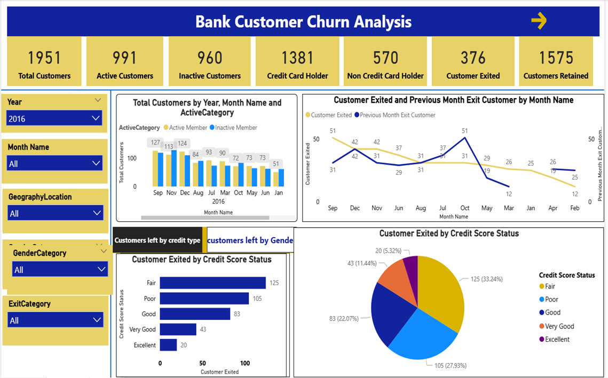

# POWER-BI-Project2_Bank-Customer-Churn-Analysis

#### Dashboard-Bank Customer Churn Analysis

#### Dashboard - Churn%

### Project Requirement

#### Data Dictionary
• RowNumber—corresponds to the record (row) number and has no effect on the output.

• CustomerId—contains random values and has no effect on customer leaving the bank.

• Surname—the surname of a customer has no impact on their decision to leave the bank.

• CreditScore—can have an effect on customer churn, since a customer with a higher credit score is less likely to leave the bank. 

Credit score:
| Credit score | Credit Score Range |
|---|---|
|Excellent| 800–850 | 
|Very Good| 740–799 |         
|Good| 670–739 |       
|Fair| 580–669 | 
|Poor| 300–579 | 

• Geography—a customer’s location can affect their decision to leave the bank.

• Gender—it’s interesting to explore whether gender plays a role in a customer leaving the bank.

• Age—this is certainly relevant, since older customers are less likely to leave their bank than younger ones.

• Tenure —refers to the number of years that the customer has been a client of the bank. Normally, older clients are more loyal and less likely to leave a bank. Please find below particulars and description to analyze the data under Tenure.

| Particulars | Description|
|---|---|
|Balance| also a very good indicator of customer churn,         as people with a higher balance in their accounts are less likely to leave the bank compared to those with lower balances. | 
|Number of Products | refers to the number of products that a customer has purchased through the bank. |       
|Has Credit Card | denotes whether or not a customer has a credit card. This column is also relevant, since people with a credit card are less likely to leave the bank. ** 1 represents credit card holder. ** 0 represents non credit card holder ** |             
|Is Active Member | active customers are less likely to leave the bank. ** 1 represents Active Member. ** 0 represents Inactive Member.**|
 
• Estimated Salary—as with balance, people with lower salaries are more likely to leave the bank compared to those with higher salaries.

• Exited—whether or not the customer left the bank.
           ** 0 represents Retain 
           ** 1 represents Exit.

•Bank DOJ — date when the Customer associated/joined with the bank.

#### Data Gathering: 

Please use the following data assets to pull the data related to Bank customer and associated details.

• ActiveCustomer

• Bank_Churn

• CreditCard

• CustomerInfo

• ExitCustomer

• Gender

• Geography 

#### Churn Analysis: 
Analyse the data and bring out few insights on the customer Churn. It is advantageous for banks to know what leads a client towards the decision to leave the company. Churn prevention allows companies to develop loyalty programs and retention campaigns to keep as many customers as possible.

##### Advanced Power BI Topics Covered: 
This report covers advanced Power BI topics, including DAX, Power BI Service, Row-Level Security (RLS), and report publishing.

Advanced Power BI Topics: DAX, Row-Level Security (RLS), Power BI Service, Report Publishing, Scheduled Refresh, Dashboards, Subscriptions, Alerts, Application/Workspace Management, Hierarchies, and Drill-Through.
